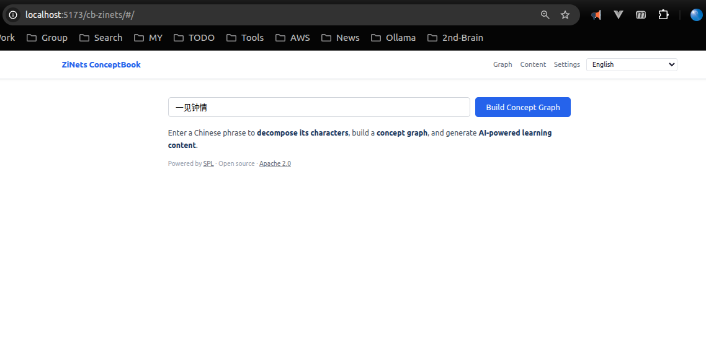
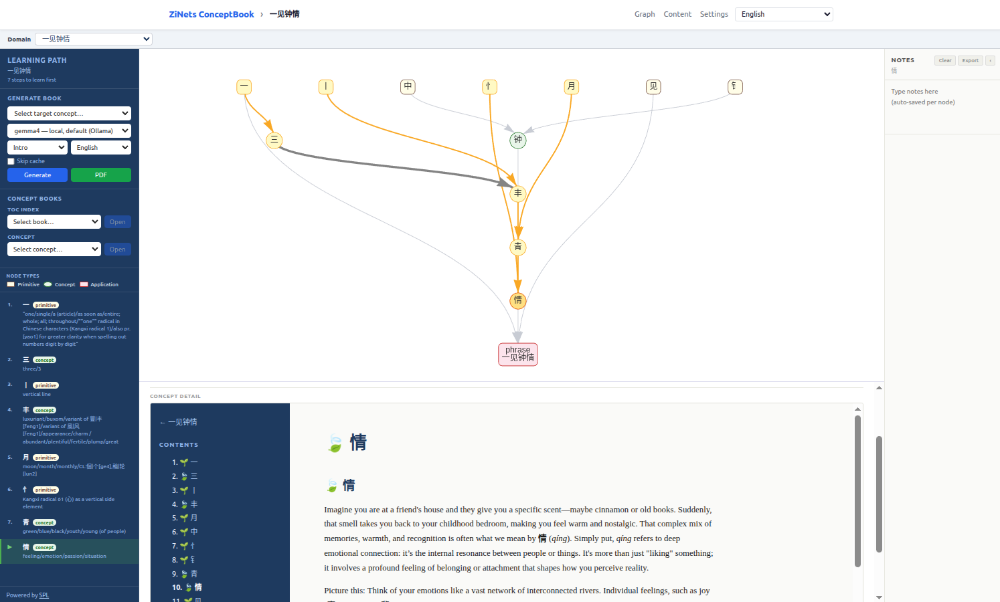
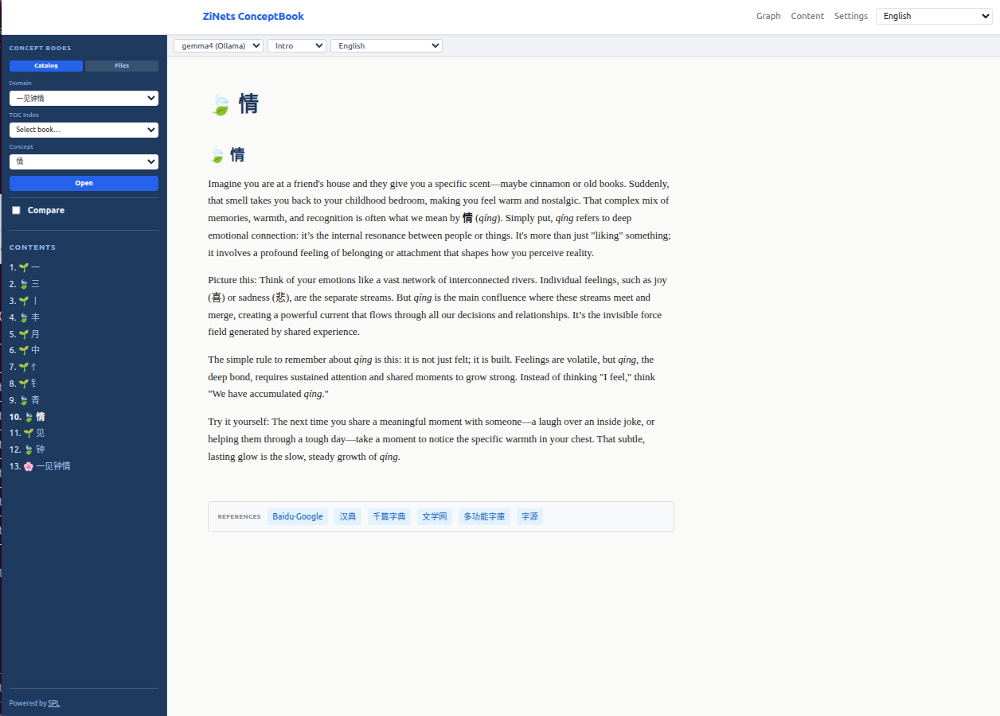

# cb_zinets — Design Reference

---

## The Story Behind ZiNets

The name is a deliberate fusion: **字** (*zì*, Chinese character) **+ Nets** (networks,
as in the internet). But the motivation runs deeper than wordplay.

### A physicist's intuition

The project was built by someone trained to look for *underlying structure* — the
physicist's reflex to ask: what are the fundamental constituents, and what are the
composition rules? In physics, quarks compose hadrons, hadrons compose nuclei, nuclei
compose atoms, and from those few dozen elementary particles the entire material universe
is built. The complexity is real, but it is not arbitrary. It emerges from a small set
of primitives governed by clear rules.

Chinese characters invite exactly the same question. The traditional account says there
are ~50,000 characters — an overwhelming inventory if treated as a flat list to memorize.
But look deeper and the list collapses. A few hundred **elemental primitives** — around
422 in the ZiNets research — combine through a small set of spatial rules (left–right,
top–bottom, enclosure, overlay) to generate the full character space. The complexity is
real, but it is *compositional*. Every character is a compressed semantic equation, not
an arbitrary symbol.

That is the physicist's intuition that launched ZiNets: **Chinese writing is a network
of structured compositions, not a collection of isolated glyphs.**

### The network is genuinely bidirectional

Most learning systems force a single direction: either top-down (here is a complex word,
learn its parts) or bottom-up (here are the strokes and radicals, build up from there).
ZiNets insists both directions are valid and both are necessary:

- **Bottom-up:** start at the primitives — 心 (heart/mind), 水 (water), 木 (tree) — and
  follow the compositional edges outward to see which characters they give rise to. This
  is the etymologist's and the child's path.
- **Top-down:** start at a phrase you want to understand — 一见钟情 (love at first sight)
  — and decompose it into its constituent characters and their primitives. This is the
  adult learner's path: motivated by meaning, drilling down to foundation.

The same graph, the same edges, traversed in opposite directions for different purposes.
Neither direction is more "correct." The network doesn't have a preferred root.

### 字Nets as an analogy for the internet

The internet metaphor is not accidental. The internet works because:

1. Every node is reachable from every other node — there is no single authoritative entry
   point.
2. Traversal is open-ended — you follow links in whatever direction your curiosity leads.
3. The value is in the *connections*, not in any individual page.

Chinese characters share all three properties. 心 (heart) connects to 情 (emotion), 忘
(forget), 想 (think), 愁 (sorrow), 慧 (wisdom) — and each of those connects outward
further. 情 connects back to 青 (blue/green/youth), which connects to 清 (clear water),
請 (to request), 晴 (clear sky). The semantic field radiates. Every character is
simultaneously a destination and a gateway.

Most learners never see this network. They encounter characters as isolated entries in a
flashcard deck. ZiNets makes the graph structure *visible* and *navigable*.

### The six open-ended gateways

The six external resources embedded in every single-character concept page — 汉典,
千篇字典, 文学网, 多功能字庫, 字源, and Baidu·Google — are a deliberate expression of
this open-ended philosophy. No single resource is authoritative. Each is a different
portal into the same underlying character network:

- 字源 and 多功能字庫 pull you toward historical etymology (Oracle Bone, Bronze scripts).
- 汉典 pulls you toward modern usage and classical definitions.
- 千篇字典 pulls you toward stroke structure and input encoding.
- 文学网 pulls you toward literary and poetic context.
- Baidu·Google opens the entire Chinese-language web.

The learner chooses their own path. The app does not enforce a curriculum; it reveals
the network and steps aside.

### cb_zinets as the curriculum layer

`cb_zinets` — this repo — adds one layer on top of the raw ZiNets network: a
**concept-based micro-book generator**. For any phrase a learner wants to understand,
it identifies the prerequisite character primitives, orders them into a learning path,
and generates a short explanatory book using a local LLM. The output is not a
translation or a grammar lesson. It is a *guided traversal of the character network*,
starting from the primitives the learner needs and building toward the phrase they care
about.

The physics analogy holds to the end: a concept book is a Feynman diagram — a
structured picture of how the elementary constituents interact to produce the observable
result.

**Step 1 — Enter a phrase:** the learner types any Chinese phrase and the app
decomposes it into its character network.



**Step 2 — Explore the concept graph:** the prerequisite characters are laid out as a
dependency graph. Clicking any node reveals its definition and inline concept detail;
the left sidebar shows the BFS learning path to reach the target.



**Step 3 — Read the concept book:** the Content view renders the full AI-generated
micro-book for the phrase. Each single character page ends with the six reference
gateway links so the learner can dive as deep as they wish.



---

## 1. What this repo is

`cb_zinets` is the ConceptBook domain app for Chinese characters. It has two jobs:

1. **Extract** — read the ZiNets decomposition database and produce a `graph.yaml` that
   maps every active character onto the ConceptBook node schema.
2. **Present** — serve that graph as an interactive concept-graph navigator and
   on-demand concept books through the same Vite + FastAPI + SPL.py stack used by
   `concept-book`.

It is a standalone repo, not a subdirectory of `concept-book`. Once the graph and
books are validated, the output is intended for integration into the `zinets_vis`
Vue.js portal (Step 5 — deferred).

### Current and planned form factors

| Phase | Form | Status |
|---|---|---|
| **Now** | Desktop web-app — local Vite dev server + FastAPI backend | Active |
| **Next** | Hosted portal — GitHub Pages static site + optional cloud API | Planned |
| **Future** | Mobile app — native or PWA, surfaces concept books on character tap | Planned |

The hosted portal phase will deploy `dist/` to GitHub Pages (`/cb-zinets/` base path is
already set in `vite.config.js`). The mobile phase targets integration with `zinets_vis`
so that tapping any character node in the ZiNets portal opens its concept book in a
sidebar or modal.

---

## 2. Architecture

```
                           ┌───────────────────────────────────────────┐
                           │              cb_zinets repo               │
                           │                                           │
  zinets_cache.sqlite ──▶  │  scripts/zinets_to_graph.py               │
  (ZiNets DB)              │     └▶ public/domains/chinese_characters/ │
                           │         input/graph.yaml                  │
                           │                                           │
                           │  scripts/concept_graph.py  ───────────────┼──▶ output/graph.html
                           │                                           │       (vis.js navigator)
                           │  spl/build_concept_book.spl ──────────────┼──▶ output/{level}.{lang}/html/
                           │    (via SPL.py runtime)                   │       concept_{zi}.html
                           │                                           │
                           │  api/   (FastAPI, port 8000)  ◀───────────┼── npm run dev (Vite, port 5173)
                           │  src/   (Vite + Vanilla JS)               │
                           └───────────────────────────────────────────┘
```

### Component map

| Layer | Path | Role |
|---|---|---|
| Extractor | `scripts/zinets_to_graph.py` | DB → `graph.yaml` |
| Visualiser | `scripts/concept_graph.py` | `graph.yaml` → `graph.html` |
| Content pipeline | `spl/build_concept_book.spl` | `graph.yaml` → `concept_{zi}.html` via SPL.py (original, cache-free) |
| Content pipeline (cached) | `spl/build_concept_book_cache.spl` | same as above with 3-tier concept cache; selected when `use_concept_cache=true` |
| Concept cache DB | `db/cb_zinets.sqlite` → `cb_concepts` | cross-domain Markdown content cache; init in `api/services/db.py` |
| Shared concept HTML | `public/concepts/{level}.{lang}/{model}/` | canonical concept HTML written once; domain dirs hold relative symlinks |
| Backend | `api/` (FastAPI) | task queue, SSE streaming, PDF, settings |
| Frontend | `src/` (Vite + Vanilla JS) | graph navigator shell, book viewer |
| Domain data | `public/domains/{id}/` | `input/graph.yaml`, `output/` (concept files are symlinks into `public/concepts/`) |
| Catalog | `public/domains/catalog.json` | domain registry read by the frontend |

### Relationship to `concept-book`

`cb_zinets` is a **fork-in-structure** of `concept-book`:

- All `src/`, `api/`, `spl/`, `scripts/concept_graph.py` are copied from
  `~/projects/digital-duck/concept-book` and kept in sync manually.
- Adaptations: `vite.config.js` (`base: '/cb-zinets/'`), `index.html` (title/icon),
  `src/i18n.js` (app title), `src/pages/About.js` (domain description),
  `api/config.py` (adds `spl_file` field).
- The unique piece is `scripts/zinets_to_graph.py` — there is no equivalent in
  `concept-book`, where graphs are authored by hand or generated in SPL.py recipes.

---

## 3. Dependencies

### Runtime

| Dependency | Version | Purpose |
|---|---|---|
| Python | ≥ 3.11 | extractor + API + SPL pipeline |
| PyYAML | any | YAML serialisation in `zinets_to_graph.py` |
| FastAPI + uvicorn | ≥ 0.111 / 0.29 | backend API |
| sse-starlette | ≥ 2.0 | SSE streaming for generation log |
| pydantic-settings | ≥ 2.0 | `api/config.py` |
| mistune | ≥ 3.0 | Markdown rendering in PDF service |
| Node.js / npm | ≥ 18 | Vite dev server and build |
| Vite | ^5.4 | frontend bundler |

### External services and sibling repos

| Service / Repo | Path | Notes |
|---|---|---|
| ZiNets SQLite DB | `~/projects/Proj-ZiNets/zinets_vis/dev_pg/backend/zinets_cache.sqlite` | source of all character data; read-only |
| SPL.py runtime | `~/projects/digital-duck/SPL.py` | concept-book generation; requires `spl123` conda env |
| **concept-book** | `~/projects/digital-duck/concept-book` | upstream for all UI / API / SPL files copied into this repo |
| **concept-book-press** | `~/projects/digital-duck/concept-book-press` | provides `pipeline.cli validate` — the authoritative graph validator |
| **zinets_vis** | `~/projects/Proj-ZiNets/zinets_vis` | Vue.js portal; future integration target (Step 5) |
| **zinets** (private) | `~/projects/digital-duck/zinets` | ZiNets research repo — papers, experiments, elemental-character studies |
| **dd-work** | `https://github.com/digital-duck/dd-work` | public index of all writing: arXiv papers, blogs, books |

#### concept-book-press in detail

`concept-book-press` is a standalone ingestion-and-extraction pipeline for creating
ConceptBook `graph.yaml` files from structured textbook sources (PDF, OpenStax HTML).
For `cb_zinets` the ingest and extract stages are replaced by `zinets_to_graph.py`,
but the **validate** stage is shared:

```bash
cd ~/projects/digital-duck/concept-book-press
python -B -m pipeline.cli validate \
  -i ~/projects/digital-duck/cb_zinets/public/domains/chinese_characters/input/graph.yaml
```

The validator (`pipeline/validate/checker.py`) runs six checks against any
ConceptBook `graph.yaml`:

| Check | What it verifies |
|---|---|
| Valid references | every `composed_of` / `needs` target exists as a node |
| Acyclic | no circular dependency chains |
| Reducible | every concept/application traces back to at least one primitive |
| Weakly connected | no orphan subgraphs (warning, not error) |
| Primitive purity | primitives have no `composed_of` dependencies |
| Tier consistency | each node's tier = 1 + max(tier of its direct dependencies) |

#### zinets research repo (private)

`~/projects/digital-duck/zinets` is a private research repository containing:

- `docs/arxiv/zinets-01`, `zinets-02`, `zinets-03` — the ZiNets paper series
- `docs/arxiv/chinese-char-as-living-fossil` — paper on characters as living semantic fossils
- `docs/research/elemental-char-*.md` — studies defining and justifying the ~422 elemental characters
- `docs/research/zinets-v*.md` / `.pdf` — versioned research manuscripts

The elemental-character research in this repo provides the intellectual foundation for
the primitive classification used in `zinets_to_graph.py`. When the primitive/elemental
definition changes (e.g., edge-case characters are reclassified), the extractor logic
should be updated to match.

#### dd-work — writing index

`https://github.com/digital-duck/dd-work` is the public-facing index of all
Digital Duck writing: arXiv preprints, Medium/blog posts, and book drafts. It is
the canonical place to find published or in-progress work that motivates the design
decisions in this repo.

### Conda environment

All Python execution (extractor, API, SPL pipeline) runs in the `spl123` conda
environment. The environment is not managed by this repo.

---

## 4. Data model

### `graph.yaml` node schema

```yaml
domain: chinese_characters

primitives:
  人:                          # node key = the character itself
    symbol: rén                # pinyin with tone diacritics
    defines: person — a walking figure
    label: person              # optional English label (zi_en)
    tier: 0                    # always 0 for primitives

concepts:
  休:
    composed_of: [人, 木]      # direct component characters
    symbol: xiū
    defines: rest — a person leaning against a tree
    label: rest
    tier: 1                    # 1 + max(tier of components)

applications: {}               # reserved for 2-char / 4-char phrases (future)
```

### `catalog.json` entry (single-domain registry)

```json
{
  "id": "chinese_characters",
  "name": "Chinese Characters",
  "nodes": 0,
  "edges": 0,
  "primitives": 0,
  "concepts": 0,
  "applications": 0,
  "tags": ["language"],
  "default_level": "intro",
  "has_navigator": false,
  "has_book": false,
  "books": [],
  "generated_concepts": []
}
```

The numeric stats and `has_navigator` / `has_book` / `books` / `generated_concepts`
fields are populated manually (or by a future update script) after the graph and
books are generated.

---

## 5. Extractor implementation (`zinets_to_graph.py`)

### Algorithm

```
1. Load all active zi (zn_zi WHERE is_active='Y'), optionally filtered by set_id.
2. Load decomposition rows (zn_zi_part WHERE is_active='Y').
   - For each row, collect non-null part fields whose value is in our active set.
   - Deduplicate components while preserving positional order.
3. Load fallback definitions from zn_character_cache.
4. Classify:
   - primitives = active zi with NO entry in zn_zi_part (or all parts outside our set)
   - concepts   = active zi with at least one in-set component
5. Compute BFS tiers:
   - Seed queue with all primitives (tier 0).
   - For each dequeued node at tier T, update each dependent's tier to max(current, T+1).
   - Decrement in-degree counter; enqueue when it reaches 0.
   - Characters with unresolved cycles or missing components get a best-effort tier.
6. Build graph dict, serialise to YAML.
```

### Pinyin conversion

`zn_zi.pinyin` stores tones as trailing digits (CC-CEDICT / MDBG format: `ren2`).
The extractor converts to Unicode diacritics (`rén`) via `to_diacritic()` using the
standard placement rules (a/e always; ou→o; last-vowel-in-final otherwise).

### Fallback chain for `defines:`

1. `zn_zi.desc_en` — hand-curated English description (preferred)
2. `zn_character_cache.meaning` — LLM-generated definition (joined on `character = zi`)
3. `zn_zi.desc_cn` — Chinese description (last resort)
4. `""` — empty string (validator will warn)

### HSK filtering (`--set-id`)

`zn_zi.set_id` groups characters by approximate frequency / HSK level:

| set_id | approx. count | meaning |
|--------|---------------|-----------------------|
| `'300'` | 250 | top-300 most-used characters |
| `'100'` | 93 | top-100 |
| `'30'` | 31 | top-30 |
| `'10'` | 9 | top-10 |
| `''` | ~10,908 | remaining (unclassified) |

Passing `--set-id 300,100,30,10` produces a ~383-character graph suitable for
prototyping and validation before scaling to the full corpus.

---

## 5.5 Decomposition strategies and recursive CTEs

Character decomposition is used in two contexts:

1. **SET-ID MODE** (`zinets_to_graph.py`): Decompose the full active character set
   (or a filtered `--set-id` subset) and build a static `graph.yaml`.

2. **PHRASE MODE** (`zinets_to_graph.py`): User submits a phrase via the web UI;
   the backend decomposes each character recursively and returns a dynamic graph.

Both use recursive SQL CTEs to walk the `zn_zi_part` tree; they differ in query
strategy.

### Pattern 1: Depth-tracking CTE (single CTE)

**Used by:** `phrase_decomposer.decompose_character()`

**Goal:** Return all reachable components with their minimum distance from the root.

```sql
WITH RECURSIVE decomposition(zi, depth) AS (
  -- Seed: the input character at depth 0
  SELECT zi, 0 FROM zn_zi WHERE zi = ?

  UNION ALL

  -- Recursive step: expand each reached node one level deeper
  SELECT comp, d.depth + 1
  FROM decomposition d
  JOIN (
    -- All positional part fields flattened into (zi, comp) pairs
    SELECT zi, zi_left_up   AS comp FROM zn_zi_part WHERE zi_left_up   != ''
    UNION ALL
    SELECT zi, zi_left      AS comp FROM zn_zi_part WHERE zi_left      != ''
    UNION ALL
    SELECT zi, zi_left_down AS comp FROM zn_zi_part WHERE zi_left_down != ''
    UNION ALL
    SELECT zi, zi_up        AS comp FROM zn_zi_part WHERE zi_up        != ''
    UNION ALL
    SELECT zi, zi_mid       AS comp FROM zn_zi_part WHERE zi_mid       != ''
    UNION ALL
    SELECT zi, zi_down      AS comp FROM zn_zi_part WHERE zi_down      != ''
    UNION ALL
    SELECT zi, zi_right_up  AS comp FROM zn_zi_part WHERE zi_right_up  != ''
    UNION ALL
    SELECT zi, zi_right     AS comp FROM zn_zi_part WHERE zi_right     != ''
    UNION ALL
    SELECT zi, zi_right_down AS comp FROM zn_zi_part WHERE zi_right_down != ''
    UNION ALL
    SELECT zi, zi_mid_out   AS comp FROM zn_zi_part WHERE zi_mid_out   != ''
    UNION ALL
    SELECT zi, zi_mid_in    AS comp FROM zn_zi_part WHERE zi_mid_in    != ''
  ) parts ON d.zi = parts.zi
  WHERE d.depth < ?            -- max_depth guard against runaway recursion
)
-- Return each part once, at its SHALLOWEST depth
SELECT zi, MIN(depth) AS depth
FROM decomposition
GROUP BY zi
ORDER BY MIN(depth), zi
```

**Parameters:** `(zi, max_depth)` — defaults to `max_depth=10`.

**Return value:** `{character: depth}` dict, e.g. for 对:

```
对  → depth 0   (the input character itself)
又  → depth 1   (direct left component)
寸  → depth 1   (direct right component)
一  → depth 2   (component of 寸)
```

**Characteristics:**
- Assigns each component a numeric distance from the root
- Useful when you need to distinguish direct dependencies from transitive ones
- Caller filters `depth == 1` to extract the `composed_of` list
- Depth tracking requires a `GROUP BY` to deduplicate paths

### Pattern 2: Parent-child edge CTE (two-CTE, edge-preserving)

**Used by:** `zinets_to_graph.load_parts_recursive()` (PHRASE MODE)

**Origin:** Implemented in `/home/papagame/projects/wgong/zistory/zinets/app/zadmin/pages/4-字形 Zi Structure.py` for visualization of character hierarchies.

**Goal:** Return all reachable components together with their *direct parents*
(preserving edge information for graph construction).

```sql
WITH RECURSIVE
  zi_part_v(zi, part) AS (
    -- Normalize 11 positional fields into (zi, part) pairs
    SELECT zi, zi_left_up    FROM zn_zi_part WHERE zi_left_up    IS NOT NULL AND zi_left_up    != '' AND is_active = 'Y'
    UNION ALL SELECT zi, zi_left       FROM zn_zi_part WHERE zi_left       IS NOT NULL AND zi_left       != '' AND is_active = 'Y'
    UNION ALL SELECT zi, zi_left_down  FROM zn_zi_part WHERE zi_left_down  IS NOT NULL AND zi_left_down  != '' AND is_active = 'Y'
    UNION ALL SELECT zi, zi_up         FROM zn_zi_part WHERE zi_up         IS NOT NULL AND zi_up         != '' AND is_active = 'Y'
    UNION ALL SELECT zi, zi_mid        FROM zn_zi_part WHERE zi_mid        IS NOT NULL AND zi_mid        != '' AND is_active = 'Y'
    UNION ALL SELECT zi, zi_down       FROM zn_zi_part WHERE zi_down       IS NOT NULL AND zi_down       != '' AND is_active = 'Y'
    UNION ALL SELECT zi, zi_right_up   FROM zn_zi_part WHERE zi_right_up   IS NOT NULL AND zi_right_up   != '' AND is_active = 'Y'
    UNION ALL SELECT zi, zi_right      FROM zn_zi_part WHERE zi_right      IS NOT NULL AND zi_right      != '' AND is_active = 'Y'
    UNION ALL SELECT zi, zi_right_down FROM zn_zi_part WHERE zi_right_down IS NOT NULL AND zi_right_down != '' AND is_active = 'Y'
    UNION ALL SELECT zi, zi_mid_out    FROM zn_zi_part WHERE zi_mid_out    IS NOT NULL AND zi_mid_out    != '' AND is_active = 'Y'
    UNION ALL SELECT zi, zi_mid_in     FROM zn_zi_part WHERE zi_mid_in     IS NOT NULL AND zi_mid_in     != '' AND is_active = 'Y'
  ),
  child_of(zi, part) AS (
    -- Base case: direct parts of root_zi
    SELECT zi, part FROM zi_part_v WHERE zi = ?
    
    UNION
    -- Recursive case: if zp.zi is a part we've already found, add its parts
    SELECT zp.zi, zp.part
    FROM zi_part_v zp
    JOIN child_of c ON zp.zi = c.part
  )
-- Return all (parent, direct_child) pairs in the subtree
SELECT zi, part FROM child_of
```

**Parameters:** `(root_zi)` — single character to decompose.

**Return value:** `{zi: [part, ...]}` dict with deduplication, e.g. for 对:

```
对 → [又, 寸]        (direct components of 对)
又 → [大, 又]       (direct components of 又)
寸 → [寸, 一]       (direct components of 寸)
...                 (and so on for transitive descendants)
```

**Characteristics:**
- Preserves parent-child relationships: result is a set of edges, not depths
- `zi_part_v` flattens all 11 positional fields into a single `(zi, part)` view
- `child_of` recursively accumulates all nodes reachable from root, joining against
  `zi_part_v` to find *what the reached node's direct parts are*
- Default deduplication via `UNION` prevents infinite loops on cycles
- Optional `union_all: True` parameter enables `UNION ALL` for duplicate-path semantics
  (useful for visualizing alternative decompositions)
- Directly yields `composed_of` without needing a depth filter

**Advantages over Pattern 1:**
- Returns *edges* not depths → caller can skip the depth-filtering step
- Natural for building adjacency-list graph representations
- Handles multiple paths to the same node more explicitly
- Avoids the `GROUP BY MIN(depth)` step, reducing query complexity

### `zn_zi_part` schema (11 positional fields)

`zn_zi_part` records the spatial decomposition of each character.
The 11 part fields correspond to positions in the character's bounding box:

```
┌──────────────┬──────────────┬───────────────┐
│  zi_left_up  │    zi_up     │  zi_right_up  │
├──────────────┼──────────────┼───────────────┤
│   zi_left    │   zi_mid     │   zi_right    │
├──────────────┼──────────────┼───────────────┤
│ zi_left_down │   zi_down    │ zi_right_down │
└──────────────┴──────────────┴───────────────┘
         zi_mid_out (enclosing frame)
         zi_mid_in  (enclosed content)
```

Empty string means that position is unused. Example for 对 (`对||又||||||寸|||`):

| zi_left_up | zi_left | zi_left_down | zi_up | zi_mid | zi_down | zi_right_up | zi_right | zi_right_down | zi_mid_out | zi_mid_in |
|---|---|---|---|---|---|---|---|---|---|---|
| _(empty)_ | 又 | _(empty)_ | _(empty)_ | _(empty)_ | _(empty)_ | _(empty)_ | 寸 | _(empty)_ | _(empty)_ | _(empty)_ |

### Known bug — fixed 2026-06-28

**Symptom:** In phrase graphs (PHRASE MODE via Pattern 1), a character could appear
as an isolated node with no edge to its parent, even when it should be a direct component.
For example, 又 appeared isolated in 对牛弹琴 despite being a direct component of 对.

**Root cause:** A component can appear at multiple depths when it is both a direct
part of the target character AND a transitive part via another component.
For 对: 又 is at depth 1 (direct part of 对) and also at depth 2 (because 寸 = 又 + 一).

The original depth-tracking query used `SELECT DISTINCT zi, depth`, which returns
*both* rows `(又, 1)` and `(又, 2)`. Building the dict `{row[0]: row[1] for row in rows}`
then overwrites depth 1 with depth 2, so `又` is assigned depth 2 and excluded from the
`composed_of = [c for c, d in decomp.items() if d == 1]` filter.

**Fix (Pattern 1):** Replace `SELECT DISTINCT zi, depth` with
`SELECT zi, MIN(depth) AS depth … GROUP BY zi` so each component appears exactly once
at its shallowest (most direct) depth.

**Why Pattern 2 avoids this:** The edge-preserving two-CTE (Pattern 2) never looks at
depths; it returns parent-child edges directly. Since it preserves all edges without
depth-based filtering, the issue does not occur: if 又 is a direct child of 对 in
`zn_zi_part`, it will appear in the result as such, regardless of whether it also
appears deeper in the tree.

---

## 6. Assumptions

1. **Primitive = no decomposition in `zn_zi_part`.**
   A character is treated as primitive if it has no row in `zn_zi_part` with at
   least one non-null part field whose value is also in the active set. This matches
   how ZiNets defines "elemental" but misses characters that *have* a decomposition
   row yet are traditionally considered atomic (e.g., some KangXi radicals that are
   technically decomposable in the database). These are accepted as primitives for
   now and flagged in §7.

   **Terminology note — "primitive" vs "elemental" in the Chinese character domain.**
   In the ConceptBook framework, *primitive* is the generic term for any foundational
   node with no further decomposition — the floor of the DAG. For Chinese characters
   this label risks confusion with historical or palaeographic usage: the "original"
   forms of characters (Oracle bone script, 甲骨文; Bronze inscriptions, 金文) are a
   separate scholarly concept referring to ancient writing systems, not to modern
   composition units.

   To avoid this confusion the ZiNets research uses the term **elemental characters**
   (汉字基本单元) for the ~422 nodes that sit at tier 0. "Elemental" signals
   *compositional role* — these are the indivisible bricks for the purpose of the
   modern composition rule — without implying they are historically primitive or
   graphically undecomposable in every palaeographic tradition. The `graph.yaml`
   node kind remains `primitive` (matching the ConceptBook schema), but all
   documentation and UI copy should prefer "elemental" when discussing the Chinese
   character domain specifically.

   Not surprisingly, many elemental characters can be traced to Oracle forms.

2. **Components outside the active set are silently dropped.**
   If character A decomposes into B + C but C is not in the active set (e.g., because
   of a `--set-id` filter), C is excluded from `composed_of`. If that leaves A with
   no components, A is reclassified as a primitive. This is correct behaviour for
   filtered subsets.

3. **No duplicate component roles.**
   The 11 positional fields in `zn_zi_part` (`zi_left`, `zi_right`, `zi_up`, …) can
   repeat the same character (e.g., 林 = 木 + 木). The extractor deduplicates:
   `composed_of: [木]`, not `[木, 木]`. The `pieces:` field (used in the pilot to
   list repeated bricks) is not generated — the ConceptBook SPL pipeline does not
   currently use it.

4. **BFS tiers are well-defined only for DAGs.**
   Cycles in `zn_zi_part` (which should not exist but may occur due to data quality)
   cause some nodes to keep non-zero `remaining_deps` and never enter the BFS queue.
   These receive a best-effort tier computed from whatever part tiers are available.

5. **Pinyin is single-reading only.**
   `zn_zi.pinyin` stores one reading per character. Polyphonic characters (多音字,
   e.g., 行 xíng / háng) are represented by whichever reading the database records
   as primary.

---

## 7. Limitations

### Data gaps

- **`applications:` is empty.** The `zn_zi` table contains only single characters;
  2-character and 4-character idiomatic phrases (compound words) require a separate
  data source not yet available in `zinets_cache.sqlite`.

- **~10,908 characters have no `set_id`.**
  These are active in the database but have no HSK-level classification. They are
  included in the default (no-filter) run but excluded by any `--set-id` filter.

- **`zi_en` coverage is sparse.**
  Many characters have no English label in `zn_zi.zi_en`. The `label:` field is
  omitted from the node in those cases; the frontend falls back to the character
  itself as the display key.

- **`desc_en` coverage is partial.**
  Not every character has a hand-curated `desc_en`. The LLM fallback
  (`zn_character_cache`) covers 61 characters in the HSK subset; the remaining
  characters fall back to `desc_cn` or an empty string.

### Structural

- **Elemental edge-cases.**
  Some characters among the ~422 primitives are not standalone Unicode characters
  (e.g., variant forms or graphical components used only inside other characters).
  They appear as nodes but cannot be displayed by the browser's default font.
  This is a known gap from traditional dictionaries and is accepted for now.

- **`catalog.json` stats are static.**
  The `nodes`, `edges`, `primitives`, `concepts`, `applications` counts in
  `public/domains/catalog.json` are set to `0` by default and must be updated
  manually (or by a future helper script) after each graph regeneration.

- **No incremental update.**
  `zinets_to_graph.py` always rewrites `graph.yaml` from scratch. There is no
  diff or merge mode.

- **Concept books are not regenerated automatically.**
  When `graph.yaml` changes (e.g., after a database update), previously generated
  `concept_{zi}.html` files are not invalidated. Re-generation is a manual step.

### Planned but not yet implemented

- Convert `catalog.json` stats automatically after graph generation.
- Add `applications:` from a compound-word source.
- `zinets_vis` integration (Step 5): sidebar panel surfacing `concept_{zi}.html`
  when a character node is tapped in the Vue.js portal.

---

## 8. Roadmap

The items below are not yet designed or implemented. They are captured here so that
future architecture decisions can account for them.

### 8.1 Hosted portal

Deploy the static `dist/` build to GitHub Pages and, optionally, a lightweight
cloud API for on-demand book generation without a local SPL.py install.

- `vite.config.js` base path (`/cb-zinets/`) is already set for GitHub Pages.
- `npm run deploy` already builds and pushes to `gh-pages`.
- Remaining work: CI pipeline, cloud API hosting, CDN for pre-generated books.

### 8.2 Mobile app

A mobile-first view (or PWA) that integrates with the `zinets_vis` Vue.js portal.
When a user taps a character node, the app opens the corresponding concept book in a
sidebar or full-screen panel.

- Concept books are self-contained HTML files — they can be embedded in any WebView.
- Link pattern: `{CB_BASE}/chinese_characters/output/intro.zh/html/concept_{zi}.html`
- Design is deferred until the graph and books are validated at scale (Step 5).

### 8.3 Context-aware note-taking

Allow learners to annotate any concept book page with personal notes, mnemonics, or
stroke-order reminders. Notes are:

- Stored locally (localStorage or IndexedDB) in the browser — no backend required
  for the basic version.
- Keyed by `(domain, zi, level, lang)` so switching language/level preserves notes.
- Exportable as JSON or Markdown for backup and sharing.

A future server-side variant would store notes in a user account and sync across
devices (relevant to the hosted-portal phase).

### 8.4 Learning management

Track which characters a learner has studied, which concept books they have read, and
which bricks they have mastered. Core features:

- **Progress state** per character: unseen → introduced → practised → mastered.
- **Spaced repetition hooks**: surface characters whose tier-1 bricks are mastered
  but the composed character has not yet been introduced.
- **`gap()` integration**: the SPL `answer_on_demand.spl` already implements a gap
  function (concepts a learner still needs vs. what they already know). Learning
  management provides the known-set as input.
- **HSK tier dashboard**: visualise coverage across `set_id` groups.

Persistence: localStorage for single-device; a lightweight backend (FastAPI + SQLite
or cloud DB) for multi-device sync in the hosted-portal phase.

### 8.5 Sharing and collaborative learning

Enable learners and teachers to share concept books, note collections, and learning
paths.

- **Static share links** — a pre-generated concept book URL is shareable immediately
  (it is just a static HTML file on the hosted portal).
- **Annotated share links** — encode note highlights as URL fragments or short codes,
  loadable by anyone who opens the link.
- **Classroom collections** — a teacher assembles a curated subset of characters
  (e.g., HSK1 + key radicals) into a shareable "collection" that sets the graph
  viewport and pre-generates books for all nodes in the set.
- **Collaborative annotation** — multiple users annotate the same concept book; notes
  are merged and displayed with author tags (requires the server-side notes backend
  from §8.3).

These features are additive and do not require changes to the core graph or book
generation pipeline.

---

## 9. Task Queue for Book Generation

### Problem

Each `/api/generate` request spawns an `spl3` subprocess directly inside the SSE async
generator (`api/services/executor.py`). This has two failure modes:

- **Client disconnect** — when the user navigates away, `sse_starlette` cancels the async
  generator. The `spl3` subprocess keeps running (no `proc.kill()` cleanup), but
  `mark_book_generated()` is never called because `await proc.wait()` is skipped. Files
  are written to disk but `catalog.json` is not updated.
- **Concurrency** — many simultaneous users spawn N parallel subprocesses with no
  backpressure, saturating Ollama / Claude API rate limits.

### Database

**File:** `/db/cb_zinets.sqlite`  
**Table prefix:** `cb_` (distinct from ZiNets `zn_` tables)

```sql
CREATE TABLE cb_generation_tasks (
    id           TEXT PRIMARY KEY,    -- uuid4
    domain_id    TEXT NOT NULL,
    target       TEXT NOT NULL,
    level        TEXT NOT NULL DEFAULT 'intro',
    language     TEXT NOT NULL DEFAULT 'en',
    model        TEXT NOT NULL DEFAULT 'gemma4',
    status       TEXT NOT NULL DEFAULT 'pending',  -- pending | running | done | failed
    created_at   TEXT NOT NULL,       -- ISO-8601 UTC
    started_at   TEXT,
    completed_at TEXT,
    log          TEXT DEFAULT '',     -- accumulated stdout (enables reconnect)
    error        TEXT
);
```

### API Changes

| Endpoint | Description |
|---|---|
| `POST /api/generate` | Insert a `pending` task, return `{ task_id }` immediately |
| `GET /api/tasks/{id}/stream` | SSE tail of `log` column + status watch; reconnect-safe |
| `GET /api/tasks/{id}` | JSON status poll |
| `GET /api/tasks` | List recent tasks (for a future dashboard) |

### Worker

A single `asyncio.Task` launched in the FastAPI `lifespan` context. It polls for
`pending` tasks, flips status to `running`, runs `spl3`, appends log lines to the DB row
incrementally, then calls `mark_book_generated()` on success — **always**, regardless of
whether any client is connected.

### Production Path (DBOS + PostgreSQL)

Swap the SQLite worker for a DBOS `@workflow`. DBOS provides durability, retries, and
crash recovery at the PostgreSQL level. The business logic (call `spl3`, call
`mark_book_generated`) is unchanged — only the scheduling and persistence layer is
replaced.

### Current workaround

Open two browser tabs: leave the Graph page tab running generation, browse generated
content in the Content page tab. The `spl3` subprocess survives tab navigation; only the
catalog auto-update is missed (reload the Graph page after generation completes to refresh
CONCEPT BOOKS).

---

## 10. Cross-Domain Concept Cache

### Problem

A concept such as `刀` carries the same meaning regardless of which phrase introduced it.
Under the original pipeline the cache key is `(domain, concept, level, language, model)`,
so the same concept generates a redundant LLM call for every new domain that contains it:

```
domains/守株待兔/output/intro.en/gemma4/html/concept_刀.html  ← LLM call #1
domains/画蛇添足/output/intro.en/gemma4/html/concept_刀.html  ← LLM call #2 (identical content)
```

### Implementation — what was built

**Key design decision:** cache the Markdown *content* (not the HTML file), because the
HTML each domain generates includes a domain-specific TOC sidebar. Storing content avoids
symlink complexity and lets each domain render its own correct sidebar while still sharing
the LLM work.

#### Database table `cb_concepts`

**File:** `db/cb_zinets.sqlite` (created on API startup; `.sqlite` files are gitignored,
schema lives in `api/services/db.py`)  
**Table prefix:** `cb_` (distinct from ZiNets `zn_*` tables that share the same SQLite file)

```sql
CREATE TABLE IF NOT EXISTS cb_concepts (
    name         TEXT NOT NULL,
    level        TEXT NOT NULL,
    language     TEXT NOT NULL,
    model        TEXT NOT NULL,
    status       TEXT NOT NULL DEFAULT 'pending',
    created_at   TEXT NOT NULL,
    completed_at TEXT,
    content      TEXT,          -- generated Markdown section text
    content_hash TEXT,          -- sha256[:16] of content (for drift detection)
    PRIMARY KEY (name, level, language, model)
);
```

Cache key: `(name, level, language, model)` — domain-agnostic. The same concept at the
same level/language/model is stored once and shared across all domains.

#### Python service layer — `api/services/db.py`

```python
def init_db(db_path: Path = DB_PATH) -> None:
    """Create the database file and tables if they don't already exist."""
    db_path.parent.mkdir(parents=True, exist_ok=True)
    con = sqlite3.connect(db_path)
    con.executescript(_DDL)
    con.commit()
    con.close()
```

`init_db()` is called in the FastAPI `lifespan` hook (`api/app.py`) so the table is
guaranteed to exist before any request handler runs.

#### New SPL tool functions — `spl/tools.py`

**`check_concept_cache(name, level, language, model, db_path) → str`**

Returns the stored Markdown section text if `status = 'done'`, otherwise returns the
sentinel string `"miss"`. Returns `"miss"` immediately if `db_path` is empty (cache
disabled path).

**`save_concept_to_cache(name, level, language, model, content, db_path) → str`**

Upserts a row with `status = 'done'` and the Markdown content. Uses SQLite's
`ON CONFLICT … DO UPDATE` so re-running the same concept is idempotent. Returns `"ok"`
or `"skip"` (if `db_path` is empty).

#### New SPL recipe — `spl/build_concept_book_cache.spl`

A new file — `build_concept_book.spl` is **not modified** so there is no regression to the
existing pipeline. The cache-enabled recipe is `build_concept_book_cache.spl`.

**New INPUT parameters** (in addition to all params in the original recipe):

| Parameter | Type | Default | Purpose |
|---|---|---|---|
| `@db_path` | TEXT | `""` | Absolute path to `cb_zinets.sqlite`. Empty = cache disabled; recipe behaves identically to original. |
| `@shared_concepts_dir` | TEXT | `""` | Absolute path to `public/concepts/{level}.{lang}/{model}/`. Passed by executor; empty disables symlink layout. |

Note: an earlier design had a separate `@model` param as the cache key. It was removed — `@llm` (the full adapter string, e.g. `ollama:gemma4`) is used as the cache key instead, keeping one source of truth.

**Three-tier cache in the generation loop:**

```spl
-- Tier 1: cross-domain concept DB cache (fastest — 0 LLM calls)
EVALUATE @skip_cache
    WHEN = "yes" THEN
        @section := "miss"
    ELSE
        CALL check_concept_cache(@concept, @lvl, @language, @model, @db_path) INTO @section
END

EVALUATE @section
    WHEN = "miss" THEN
        -- Tier 2: SPL domain cache (fast — 0 LLM calls, domain-scoped)
        EVALUATE @skip_cache
            WHEN = "yes" THEN
                @_spl_section := "miss"
            ELSE
                CALL cache_get(@concept, "v1", '{"language":"' + @language + ...) INTO @_spl_section
        END
        EVALUATE @_spl_section
            WHEN = "miss" THEN
                -- Tier 3: LLM generation (slow — 1+ LLM calls)
                GENERATE write_section(...) INTO @section
                -- ... primitive budget check, verify, refine ...
                CALL cache_put(...) INTO @cache_key           -- populate SPL domain cache
                CALL save_concept_to_cache(...) INTO @_       -- populate concept DB cache
            ELSE
                -- SPL hit: promote to concept DB cache for future cross-domain reuse
                @section := @_spl_section
                CALL save_concept_to_cache(...) INTO @_
        END
    ELSE
        LOGGING "Concept DB cache HIT — 0 LLM calls" LEVEL INFO
END
-- Canonical HTML written to shared dir; symlink created in domain output dir
CALL write_concept_html(@concept, @section, @domain_yaml, @output_dir, @language, @shared_concepts_dir) INTO @_
```

Cache priority (fastest first):
1. **Concept DB cache** — SQLite `cb_concepts`, cross-domain, persists across server restarts
2. **SPL domain cache** — spl3 built-in `cache_get/cache_put`, per-domain, persists across runs
3. **LLM generation** — calls the model; result is written to both caches above

SPL domain cache hits are also promoted to the concept DB cache, so the next *different*
domain that shares the concept hits Tier 1 instead of Tier 2.

#### Executor integration — `api/services/executor.py`

```python
shared_concepts_dir = _get_shared_concepts_dir(level, language, model)
# → public/concepts/{level}.{lang}/{model}/

if settings.use_concept_cache:
    spl_file = _SPL_DIR / "build_concept_book_cache.spl"
    cache_params = ["--param", f"db_path={settings.db_path}"]
else:
    spl_file = _SPL_DIR / "build_concept_book.spl"
    cache_params = []

cmd = [
    "spl3", "run", str(spl_file), ...,
    "--param", f"shared_concepts_dir={shared_concepts_dir}",
    *cache_params,
]
```

`shared_concepts_dir` is passed to **both** recipes (cached and non-cached), so the symlink
layout is always active regardless of whether the concept DB cache is enabled.

#### Settings

**`api/config.py`:**

```python
use_concept_cache: bool = False   # default off; toggleable via Settings page or CB_USE_CONCEPT_CACHE env var
db_path: Path = Path(__file__).parent.parent / "db" / "cb_zinets.sqlite"
```

**Settings page (`src/pages/Settings.js`):**

A "Concept Cache" card with a toggle switch was added to the Settings page grid.
The toggle reads from and writes to `GET/PUT /api/settings`. The backend setting
takes effect on the next generation run without a server restart.

#### API endpoint changes — `api/routers/settings.py`

`use_concept_cache: bool` added to both `SettingsResponse` (GET) and `SettingsUpdate`
(PUT body).

### Shared canonical HTML + symlinks

Concept HTML files are stored **once** and shared across domains via relative symlinks:

```
public/
  concepts/
    intro.en/
      gemma4/
        concept_一.html      ← canonical; written by first domain that generates it
        concept_犭.html
        …
  domains/
    独一无二/output/intro.en/gemma4/html/
        concept_一.html      → ../../../../../../concepts/intro.en/gemma4/concept_一.html
        concept_犭.html      → ../../../../../../concepts/intro.en/gemma4/concept_犭.html
    一举两得/output/intro.en/gemma4/html/
        concept_一.html      → ../../../../../../concepts/intro.en/gemma4/concept_一.html
        …                    (same inode — zero duplication)
```

**`write_concept_html(concept, section, domain_yaml, output_dir, language, shared_dir)`**

When `shared_dir` is provided (always the case when called via the executor):

1. Write canonical HTML to `{shared_dir}/concept_{name}.html` — **skipped** if the file
   already exists (cache hit for second+ domains sharing this concept).
2. Create a relative symlink from `{output_dir}/concept_{name}.html` → canonical file.
3. Falls back to `shutil.copy2` if `symlink_to` raises `OSError` (Windows without
   Developer Mode).

**TOC link behaviour:** The concept HTML includes a sidebar TOC with relative links
(`href="concept_独.html"` etc.). When the browser resolves these links, it uses the
symlink's URL (the domain dir), so all sibling concepts in that domain are found
correctly. The TOC itself reflects whichever domain first generated the concept — a known
and accepted trade-off.

**`build_book_index()`** reads `concept_{name}.html` from the domain output dir via
`read_text()`, which follows symlinks transparently. No changes needed.

**`mark_book_generated()`** globs `concept_*.html` from the domain html dir — symlinks
are returned by `glob()` normally. No changes needed.

### Performance impact

- **First generation** of a concept at `(level, language, model)`: one LLM call; Markdown
  stored in `cb_concepts`; canonical HTML written to `public/concepts/`.
- **Subsequent domains** sharing the concept: zero LLM calls (`cb_concepts` hit); canonical
  HTML already on disk (skipped); only a symlink is created.
- **Re-run of the same domain**: zero LLM calls (SPL domain cache or `cb_concepts` hit);
  canonical HTML exists (skipped); symlink recreated.
- With N phrases sharing k% character overlap, LLM calls drop by up to k% after the
  first phrase is fully generated.

### Frontend / serving impact

The frontend loads concept HTML via domain-relative URLs
(`domains/{id}/output/{variant}/{model}/html/concept_{name}.html`). These URLs resolve
through the symlinks transparently in both the Vite dev server and a static file server.

For `npm run deploy` (GitHub Pages), Vite copies `public/` as-is. Whether symlinks are
followed depends on the OS and Node.js version. On Linux (the standard CI environment)
Vite's file copy follows symlinks, so `dist/` will contain the real files. If deployment
breaks on a platform that doesn't follow symlinks, run a pre-build `cp -rL public/concepts
public/concepts_real` and adjust paths, or pre-expand symlinks with `rsync -L`.

### LLM hex-escape decoder

Some local models (Gemma4 via Ollama) emit CJK characters as raw UTF-8 byte escapes in
their output text — e.g. `犭` becomes `<0xE7><0x8A><0xAD>`. The helper
`_decode_hex_escapes(text)` in `spl/tools.py` detects consecutive `<0xHH>` sequences and
decodes them back to Unicode before the content is written to HTML. It is called at the
entry of `write_concept_html()` so both new generation and cache-hit paths are covered.

To fix an already-corrupted canonical file: delete it from `public/concepts/…/` and
re-trigger generation. The cached Markdown in `cb_concepts` (which may also contain the
escape sequences) will be decoded by `_decode_hex_escapes` before writing.

### Migration (completed 2026-06-28)

All previously generated `concept_*.html` files across all phrase domains were migrated
on 2026-06-28: canonical copies were moved to `public/concepts/intro.en/gemma4/` and
replaced in-place with relative symlinks. 75 unique concepts shared across 10 domains.

---

## 11. Chinese Character Reference Resources

For any single Chinese character, six external resources are embedded as a reference
row at the bottom of its concept HTML page. These links are injected as a post-processing
step inside `write_concept_html()` in `spl/tools.py` — after the LLM content is rendered
to HTML — so they are never part of the LLM prompt and are never affected by token budget
truncation.

The same six resources were pioneered in the `zinets_vis` Search tab, so the link set is
consistent across both apps.

### URL patterns

| Button | URL pattern | Notes |
|---|---|---|
| **Baidu · Google** | `https://www.google.com/search?q=baidu+{char}` | Google search scoped to Baidu Baike results — fastest way to reach the Chinese-language encyclopedia entry |
| **汉典** | `https://www.zdic.net/hans/{char}` | The most authoritative free Chinese dictionary. Shows pinyin, stroke count, radical, Kangxi code, variants, classical definitions, and usage examples |
| **千篇字典** | `https://zidian.qianp.com/zi/{char}` | Comprehensive stroke-by-stroke reference. Includes radical lookup, stroke count, Cangjie/Wubi input codes, traditional variant, compound words, and a calligraphy grid |
| **文学网** | `https://zd.hwxnet.com/search.do?keyword={char}` | Literature-oriented dictionary. Strong on classical/literary usage, idioms, and cross-referenced phrases. Includes radical tree and five-stroke input codes |
| **多功能字庫** | `https://humanum.arts.cuhk.edu.hk/Lexis/lexi-mf/search.php?word={char}` | CUHK (Chinese University of Hong Kong) multi-function character database. Shows the character across historical scripts: Oracle Bone (甲骨文), Bronze inscriptions (金文), and Liushutong seal variants (六書通) — essential for etymology research |
| **字源** | `https://hanziyuan.net/#{char}` | Focused etymological viewer. Displays Oracle, Bronze, Seal and modern forms side by side with stroke-level comparison. Best for understanding how a character's shape evolved |

The content page below shows the reference row as it appears to the learner — a single
line of gateway links at the bottom of the concept explanation, unobtrusive but always
present for every single-character concept.


### What each resource is strongest at

| Need | Best resource |
|---|---|
| Quick overview + modern usage | 汉典 (zdic.net) |
| Stroke count / input code / compounds | 千篇字典 |
| Classical / literary context | 文学网 |
| Historical script forms (Oracle / Bronze) | 字源 or 多功能字庫 |
| Broadest web search (Chinese sources) | Baidu · Google |
| Academic etymology with image comparison | 多功能字庫 (CUHK) |

### Implementation

**`spl/tools.py`** — helper functions added 2026-06-29:

```python
_CHAR_RESOURCE_LINKS = [
    ("Baidu·Google", "https://www.google.com/search?q=baidu+{char}"),
    ("汉典",          "https://www.zdic.net/hans/{char}"),
    ("千篇字典",      "https://zidian.qianp.com/zi/{char}"),
    ("文学网",        "https://zd.hwxnet.com/search.do?keyword={char}"),
    ("多功能字庫",    "https://humanum.arts.cuhk.edu.hk/Lexis/lexi-mf/search.php?word={char}"),
    ("字源",          "https://hanziyuan.net/#{char}"),
]

def _is_single_cjk(s: str) -> bool:
    """True if s is exactly one CJK unified ideograph."""
    ...

def _char_resources_html(char: str) -> str:
    """Generate a styled row of reference links for a single Chinese character."""
    ...
```

`{char}` is percent-encoded with `urllib.parse.quote(char, safe='')` before substitution,
producing stable URLs across all HTTP clients.

`write_concept_html()` calls `_is_single_cjk(concept)` and, when true, injects the
resource row via `html.replace('</main>', _char_resources_html(concept) + '\n  </main>', 1)`
before writing the file. Multi-character concepts (phrases, idioms) are unaffected.

**Backfill (2026-06-29):** The 90 already-generated single-character concept HTML files in
`public/concepts/intro.en/gemma4/` were patched in-place using the same injection logic.

---

## catalog.json — Static vs. Database (2026-06-30)

### Current architecture

`public/domains/catalog.json` is a static JSON file generated by `zinets_to_graph.py` and
served alongside the HTML/JS frontend. The frontend loads it with a single `fetch()` call
(cached by the browser) to populate the domain, book, and concept dropdowns.

### Why keep static catalog.json

- **Static-first / GitHub Pages deployable** — the entire app runs with `npm run dev` and
  no backend. Can be hosted on GitHub Pages, S3, or Netlify with zero server.
- **Offline learning** — students with poor internet can download the static build and use
  it locally. This is a first-class use case, not a fallback.
- **One fetch, browser-cached** — no per-request query overhead; even at 11k characters
  the JSON is a few hundred KB loaded once.
- **The Catalog/Files toggle is already a hybrid hook** — "Catalog" mode uses the static
  JSON; "Files" mode hits `/api/browse/` backed by the live filesystem/DB. Both coexist.

### Portal release (future)

For a server-centric portal release, the backend will expose a `/api/catalog` endpoint
backed by the SQLite DB, enabling:

- Server-side filtering by model, level, language, tag, set_id
- Real-time reflection of newly generated content without a rebuild step
- Per-user progress tracking and personalization

The frontend already has the toggle architecture to switch between static and API-backed
modes — wiring up `/api/catalog` is an additive change, not a rewrite.

**Even for the portal release, keep the static export feature.** Generating a self-contained
static bundle for offline use (school settings, poor connectivity, local study) is a
distinct value proposition worth maintaining long-term.

### Targeted fix implemented (2026-06-30)

Previously, `update_catalog()` in `zinets_to_graph.py` only updated graph stats (nodes,
edges, primitives) but never refreshed `books` or `generated_concepts` — so catalog.json
went stale after every SPL generation run.

**Fix:** Added `_scan_generated_content(domain_path)` which walks
`output/{level}.{lang}/{model}/html/` and rebuilds `books` and `generated_concepts` from
the actual filesystem on every `zinets_to_graph.py` run. catalog.json now stays current
as a side effect of graph generation — no manual step required.

```
output/
  intro.en/
    gemma4/html/book_phrase_对牛弹琴.html   → books entry  (model: gemma4)
    gemma4/html/concept_一.html             → generated_concepts entry
    sonnet/html/concept_一.html             → generated_concepts entry  (model: sonnet)
```
Phrase concept files (`concept_phrase_*.html`, `concept_一见钟情.html`, etc.) were skipped.
